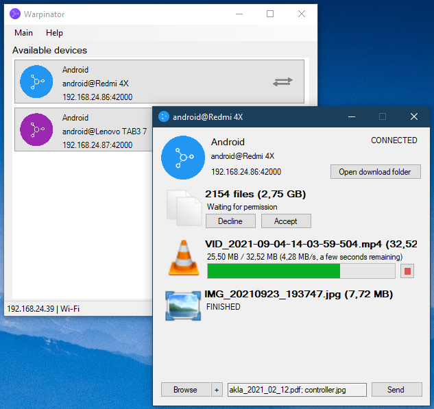

# Warpinator for Windows (unofficial)

This is an unofficial reimplementation of Linux Mint's file sharing tool [Warpinator](https://github.com/linuxmint/warpinator) for Windows 7 and newer.

Transfer files between Linux, Windows and Android devices

## ⚠️ Warning: Fake/malicious website

`http://warpinator.com` is a fake website, potentially malicious!

Do **NOT** download or run any software from it!

We do not know who maintains it. See [notice from the Linux Mint team](https://github.com/linuxmint/warpinator?tab=readme-ov-file#%EF%B8%8F-warning-fakemalicious-website).

## Download
Now available on the [Releases](https://github.com/slowscript/warpinator-windows/releases) page

Alternatively can be installed via winget:  
`winget install slowscript.Warpinator`

## Building
Requires .NET SDK 4.7.2

Build with Visual Studio

### Screenshot

## Translating
You will need a recent version of Visual Studio
1) Create a new Resource file in the Resources folder called Strings.xx.resx where xx is code of the language you are translating to
2) Copy the entire table from Strings.resx and translate the values. Comments are only for context
3) Open Controls\TransferPanel, Form1, SettingsForm and TransferFrom in designer and repeat 4-6 on each of them
4) Select the toplevel element (whole window) and under Properties switch Language to your language
5) Select controls with text on them (buttons, labels, menus) and translate their "Text" property. You don't need to translate obvious placeholders that will be replaced at runtime. Can be verified by simply running the application (green play arrow in toolbar). Also, two buttons on TransferPanel are hidden below the other two.
6) You can also move and resize the controls to fit the new strings and it will only affect the currently selected language
